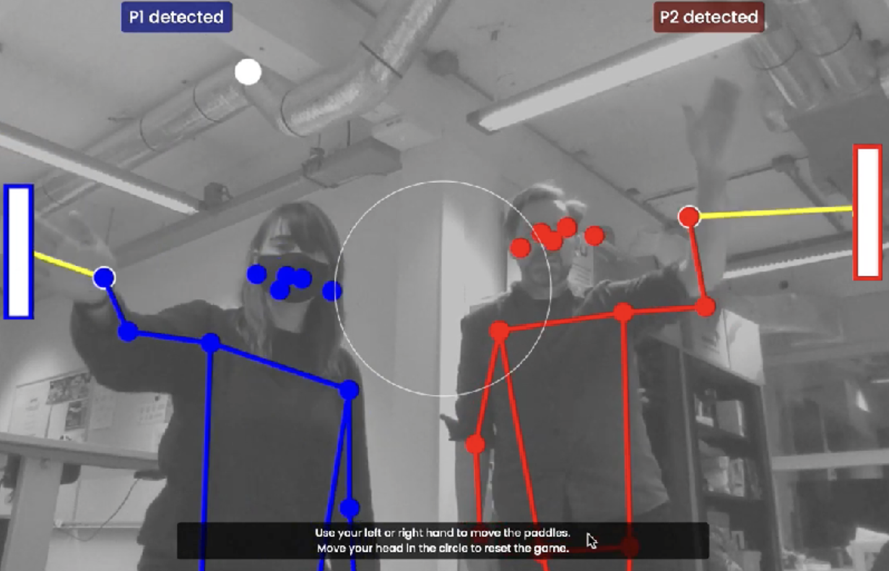

# Pose Pong

Playing pong with body poses

## Posenet

This example loads ML5 Posenet to detect body poses.
For each pose, the wrist coordination is passed to the PONG game, to draw the paddles.

- [Youtube demo](https://www.youtube.com/watch?v=DMebdxAp0j0)
- [ML5 Posenet](https://learn.ml5js.org/#/reference/posenet)
- [Pong Game code](https://glitch.com/~pong-game-canvas)

## TODO

- 🧹 Clean up script.js 
- Better player detection
- Test with better GPU